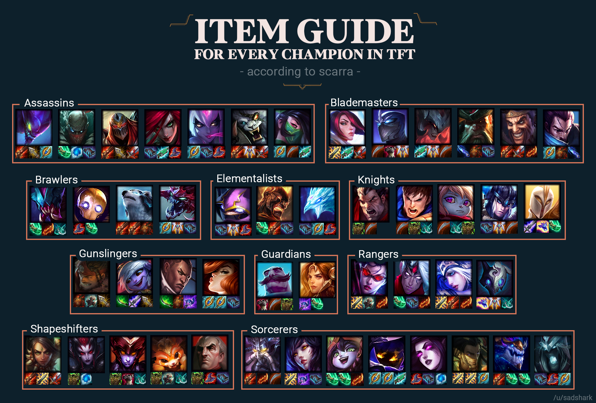

# CS 2.2 Graph Modeling Project - League of Legends Team Fight Tactics Item System

## Project Description
I will be modeling a Graph ADT (Abstract Data Structure) to take in data of all the items in TFT(Team Fight Tactics). With it, I will be introducing a set of problems and solve them using graph theory in python. The input data will be small but the project will be able to scope and scale to a real world problem.

## Project Problems
- A clique of champions based on the items they are recommended to share.
- Based on an item you have, outputs which campions can you give it to.
- Which champion has an item that is not recommended to any other champion.
